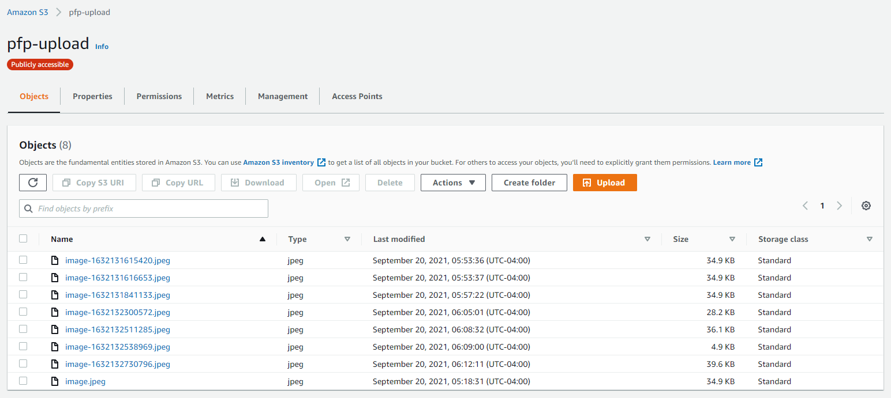
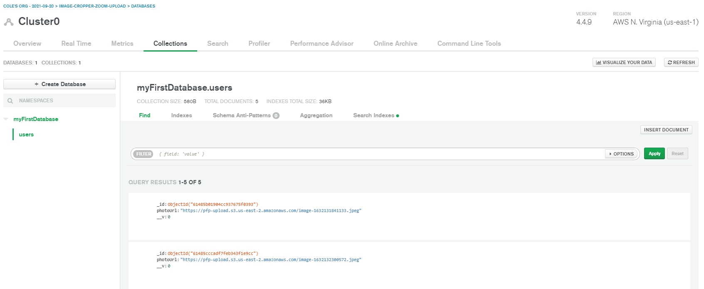
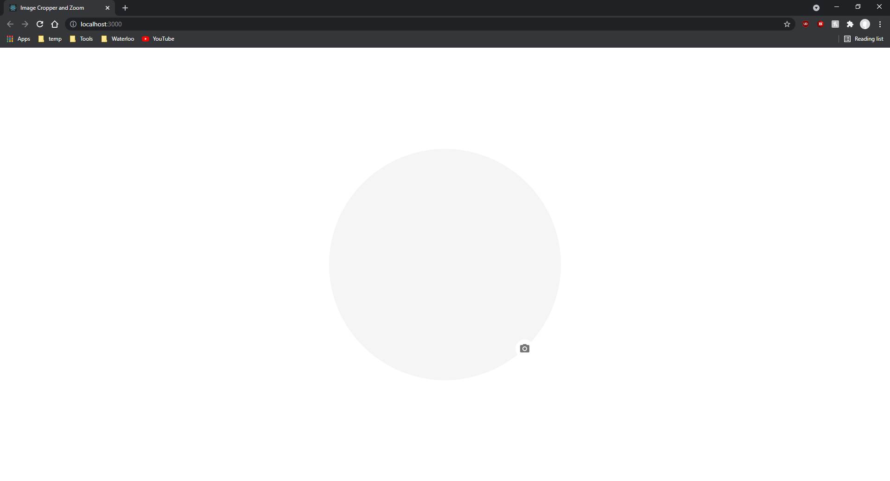
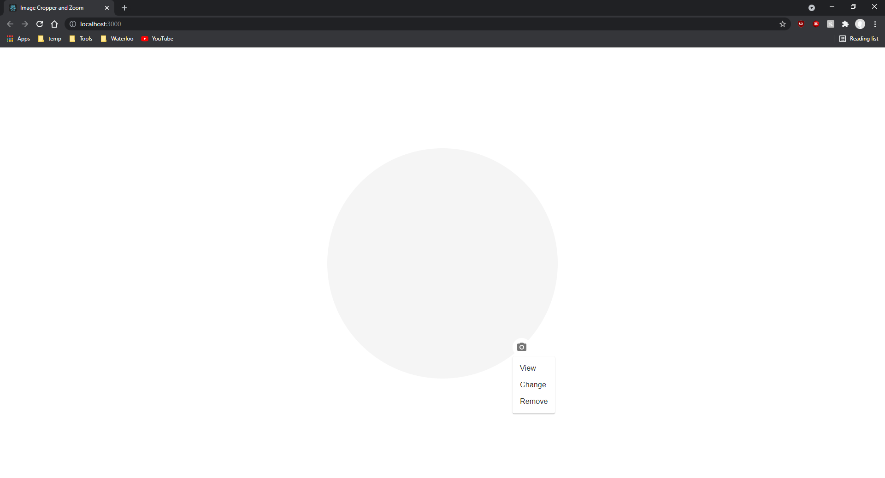
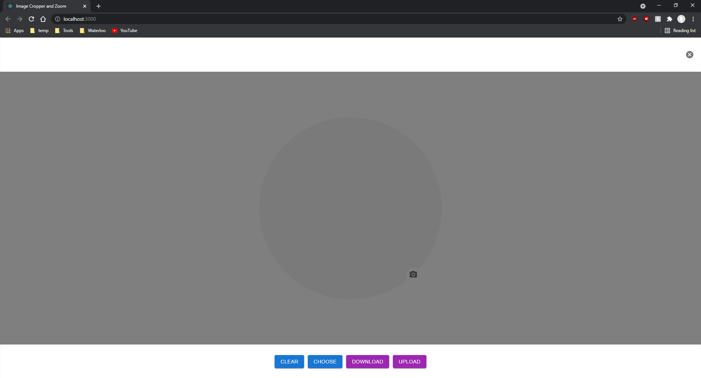
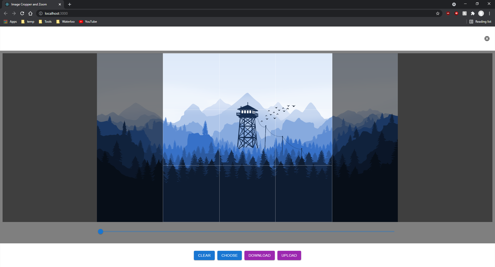
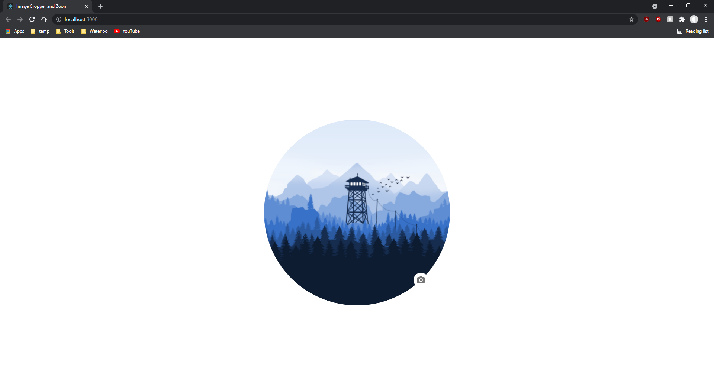

# Shopify-developer-intern-challenge

My submission. TASK: Build an image repository.

# Implementation

Images are stored in an Amazon AWS S3 Bucket. Associated image URLs are stored in a MongoDB database. Webapp created using React, Express, Node, Mongoose, Multer.

# Demo

S3 Bucket:

MongoDB Database:

Walkthrough of upload process:

# Running it yourself

1. Run `npm install` in both the repository root directory and `/server/`
2. Copy the contents of `/server/config.env.example` into a new file called `/server/config.env`
3. Supply the necessary information to `/server/config.env`\*
4. Run `npm run start` in the root directory
5. Open a second terminal and run `npm run server` in `/server/`

\*This will require a MongoDB Atlas and AWS account. If you do not want to go through those steps, then you can skip step 5. You will still be able to interact with the front end, but the databases will not be connected so the cropped image will not be displayed at the end. Here is the download link for the image I cropped and uploaded in the demo as some extra proof that the backend works:

https://pfp-upload.s3.us-east-2.amazonaws.com/image-1632259076376.jpeg
